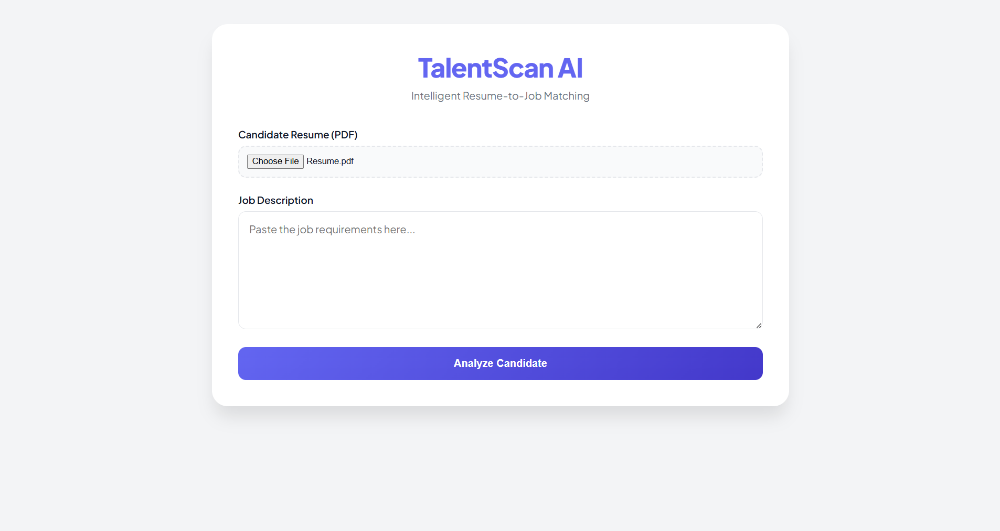
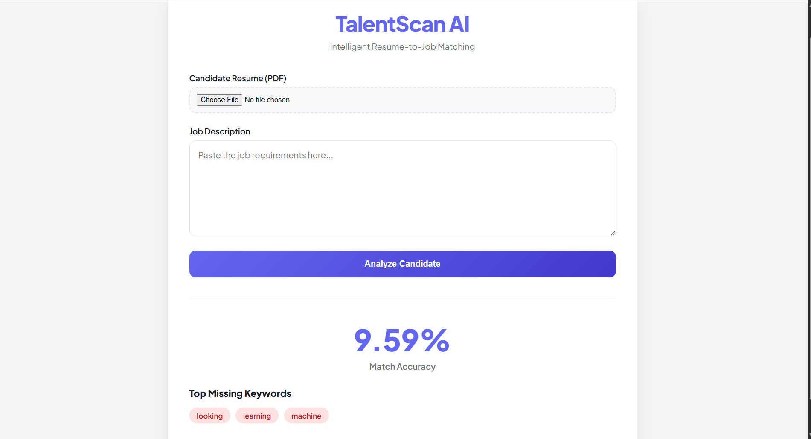

# TalentScanAI 
# TalentScan AI

TalentScan AI is a Flask-based application that analyzes resumes against job descriptions and calculates a similarity score.

## Features
- Resume vs Job Description matching
- Keyword analysis
- Simple AI similarity scoring
- Web interface using Flask

## Tech Stack
- Python
- Flask
- NLP (basic similarity scoring)

## Run Locally

pip install -r requirements.txt
python app.py

Open: http://127.0.0.1:5000

## Screenshots

